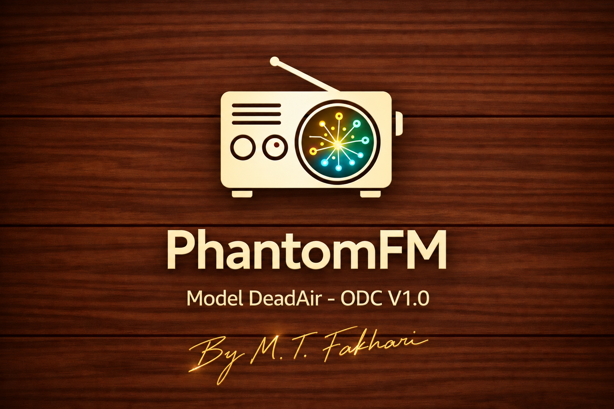

# **PhantomFM v1.0 — DeadAir-ODC**

  

> **A research prototype for generating continuous and interactive audio experiences, similar to radio, using natural language processing, text generation, speech synthesis, audio buffering, and human-centered interaction design.**

<!-- Add your project poster here after uploading it to the repository, for example:

  

-->

PhantomFM is an experimental audio system that explores a simple question:

> **“What would it feel like if an AI-generated audio stream did not feel like an AI system at all, but instead tried to feel like a radio station that had always existed?”**

The project combines natural language processing, procedural text generation, text-to-speech, audio buffering, user-intent classification, and interactive response generation to recreate the continuity, personality, and unpredictability of a live radio experience.

Rather than treating speech synthesis as merely an output layer, PhantomFM treats the entire listening experience as a system that can be deliberately designed and engineered.

---

## ✦ The Idea

Modern technology is increasingly optimized around function, efficiency, and highly refined visual interfaces. Human interaction with technology, however, is not purely functional.

People also remember atmosphere, personality, continuity, human imperfections, familiarity, and emotional presence.

PhantomFM explores the gap between a system that is technically functional and one that feels present.

The project is part of a broader creative direction called **“Lostness”**—an exploration of how contemporary technology might recover some of the warmth, atmosphere, and sense of familiarity found in older media without merely imitating their surface appearance.

This idea is inspired by research suggesting that nostalgia can be associated with social connectedness, continuity of personal identity, and aspects of psychological well-being. At the same time, research on digital technology and well-being indicates that the impact of technology depends substantially on the quality and structure of interaction, rather than on the technology itself.

PhantomFM therefore asks a small and specific engineering question:

> **“Can an AI system be designed to create a stronger sense of social and emotional presence through the structure of its interaction?”**

In this project, nostalgia is treated primarily as a design and experiential direction: an exploration of whether an artificial system can create a sense of presence, familiarity, and continuity rather than simply presenting itself as technology.

---

## ✦ What Is PhantomFM?

PhantomFM is a prototype of an independent audio stream designed to feel like a real radio station.

The system continuously generates and plays different program segments while attempting to preserve the illusion of an ongoing radio broadcast.

The listener does not receive a collection of isolated AI-generated sentences.

**They receive a program.**

A program that includes:

- continuity,
- hosts,
- distinct personalities,
- transitions between segments,
- pauses,
- interruptions,
- reactions,
- recurring structures,
- and the possibility of interaction.

The long-term goal is to make it difficult, from the listener’s perspective, to distinguish between a conventional radio program and PhantomFM.

---

## ✦ PhantomFM v1.0 — DeadAir-ODC

The current version focuses primarily on continuity and the listening experience rather than fully real-time generation.

The system uses pre-generated and buffered audio segments to maintain several minutes of uninterrupted playback.

The goal of v1.0 was not to create a fully real-time performance. Instead, the first objective was to determine whether an AI-generated audio stream could achieve the illusion of a continuous radio station.

---

## ✦ Odyssey

The most experimental part of the current prototype is **ODC (Odyssey)**.

Odyssey allows the listener to interrupt the currently playing program and interact with the host.

The system attempts to classify the listener’s input into one of the following categories:

- question,
- comment,
- or harassment / interruption.

It then selects an appropriate response and converts it into speech.

The host can stop the current segment, react to the listener using a short filler or acknowledgment, respond to the input, generate a closing phrase, and then resume the program from the next segment.

The goal is not simply to answer a question.

**The goal is to create the feeling that the host has noticed the listener’s presence.**

---

## ✦ Designed Personalities

One of PhantomFM’s core design principles is that the hosts should not behave identically.

### Weather Host

A calm, precise, patient, and attentive host.

Their programs use a scientific and professional tone, and their responses are generally short and practical.

Occasional pauses and fillers—such as hesitation sounds—are deliberately designed to convey a slight loss of control or composure when confronted with unexpected questions.

### Political Host — Coming Soon

An opinionated and strongly partisan host.

They react more strongly to listener opinions and, rather than simply responding to them, attempt to engage the listener in an argument.

In the current fictional format, the host avoids naming real countries or real political figures.

### Parody Host — Coming Soon

A young, playful, and intentionally unserious host.

The long-term design of this character includes audience laughter, surprised reactions, jazz-inspired musical elements, and the ability to respond humorously to the listener.

Together, the three hosts are intended to demonstrate an important PhantomFM principle:

> **“A voice does not create a personality. A behavioral model does.”**

---

## ✦ Engineering Challenges

The current prototype is the result of multiple stages of experimentation, failure, and iteration.

### Character-Level Markov Text Generation

In the initial experiment, text was generated character by character.

The output contained a large number of incomplete and invalid words, making it unsuitable for speech synthesis.

The system was therefore moved to word-level generation.

This change improved the linguistic validity of the output, but semantic inconsistencies still occurred occasionally. The goal, however, is not to generate text with perfectly coherent meaning. Instead, the system is intended to generate a new listening experience each time by sampling from the dataset without becoming repetitive.

### Continuous Speech Generation

Generating speech word by word caused severe latency and unnatural prosody.

The prototype therefore moved toward segment-level synthesis and buffering.

### Pre-Buffering

Coqui TTS requires a noticeable amount of time to generate speech.

Instead of making the system wait for each segment to be generated before playback, several segments are generated in advance and stored in a queue.

The prototype currently pre-buffers five segments before playback begins.

This produces several minutes of continuous audio while subsequent segments are generated in the background.

Therefore, in v1.0, the system prioritizes **perceived continuity over fully real-time synthesis**.

### Interactive Interruption

Odyssey introduces another latency problem.

The system cannot know the listener’s future question in advance, so the response cannot be pre-recorded.

To reduce perceived latency, fillers and closing phrases are generated in advance and placed in a queue.

This allows the system to respond immediately with a natural acknowledgment while the main response is being synthesized.

---

## ✦ Current Limitations

**PhantomFM v1.0** is intentionally an experimental system.

Current limitations include:

- semantic inconsistencies in procedural text generation,
- relatively high response and speech-start latency,
- limited user-intent classification,
- dataset-dependent responses,
- limited conversational-context understanding,
- no evaluation with real users,
- limited host selection,
- and incomplete real-time interaction.

These limitations define a significant part of the development path for future versions.

---

## ✦ Roadmap

### PhantomFM v1.0 — DeadAir-ODC

**Focus:** Continuity and interaction prototype

- ✓ Continuous audio stream
- ✓ Segment-based speech generation
- ✓ Pre-buffering
- ✓ Weather program
- ✓ Odyssey interaction prototype
- ✓ Question / comment / harassment classification
- ✓ Filler and closing-phrase system
- ✓ Host-personality design

### v2.0 — 4THW411

**Focus:** Natural interaction and multi-host radio

Planned:

- multiple independent hosts,
- real-time switching between hosts,
- faster speech synthesis,
- improved natural-language generation,
- richer context-aware responses,
- voice interaction with Odyssey,
- host-specific response policies,
- improved interruption handling,
- and more natural conversational continuity.

---

## ✦ Future

The long-term vision is to create a collection of independent and interactive audio programs, rather than a single radio stream.

Potential applications include:

- interactive radio stations,
- personalized audio broadcasting,
- AI-assisted radio production,
- independent and specialized radio channels,
- interactive podcasts,
- entertainment systems,
- educational content delivery,
- brand-oriented audio experiences,
- and experimental human–AI interfaces.

The project could also explore how existing broadcasting systems might use AI to automate parts of program production while preserving the distinct identity and content policies of each program and host.

---

## ✦ Project Status

**Research Prototype — MVP**

PhantomFM v1.0 demonstrates the feasibility of the core interaction concept.

This project should not yet be considered a production-ready or fully autonomous broadcasting system for real-world deployment.

The project is currently evolving.

---

## ✦ Research Documentation

The technical development history, design decisions, experiments, and limitations are documented separately.

- [Research Report](RESEARCH.md)
- Architecture
- Design History
- Roadmap

---

## PhantomFM

> **An attempt to make a machine-generated broadcast feel a little less machine-made.**
